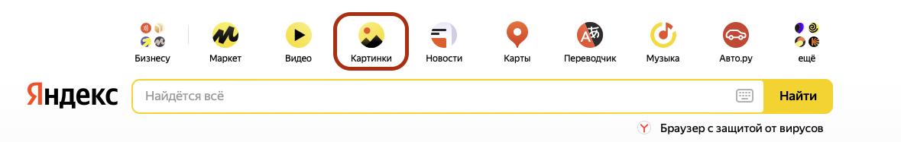
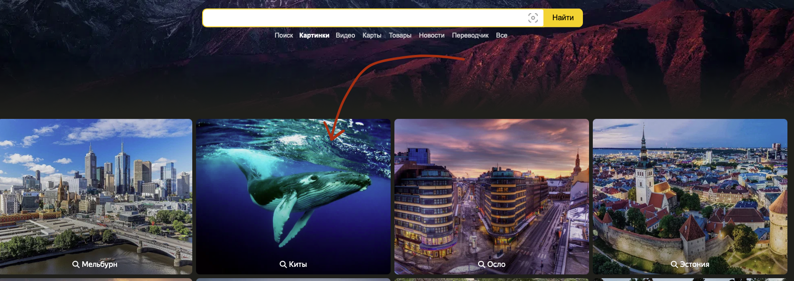
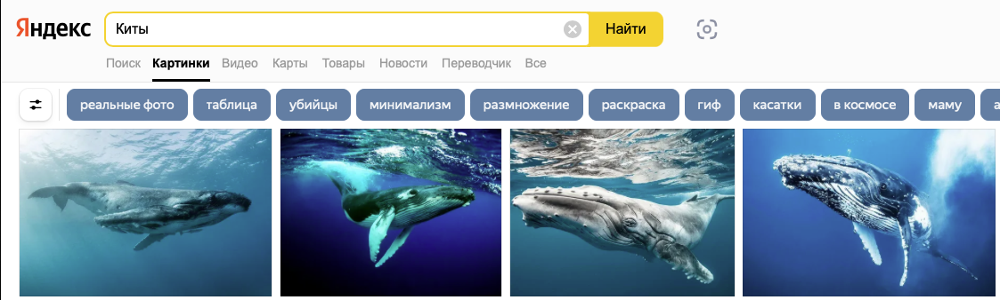
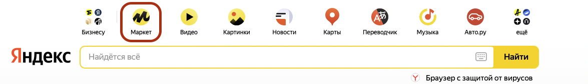
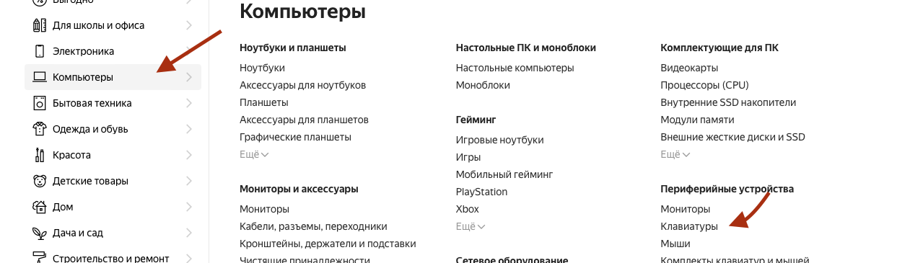

# Тестовое задание для selenium-разработчика

## Требования:

- Тесты должны быть написаны на Python
- Желательно использовать тестовый фреймворк pytest(в случае использования другого - составить инструкцию по запуску)
- Паттерн PageObject приветствуется
- Приветствуется генерация отчета (например Allure)
- Можно выполнить любой из двух сценариев, либо выполнить оба. Оцениваться будет не количество, а качество
- Готовое решение залить на GitHub и прислать ссылку

## Сценарий 1

1. Перейти на yandex.ru
2. Проверить, что присутствует поле поиска и кнопка перехода в раздел "Картинки":
   
3. Кликнуть по "Картинкам". Дождаться/Проверить, что открылась новая вкладка в браузере
4. Перейти на новую вкладку. Проверить адрес страницы, должен быть или начинаться на "https://yandex.ru/images/"
5. Кликнуть по любой категории, дождаться когда откроется страница с картинками
   
6. Проверить текст в поле поиска, должен совпадать с названием категории
   

## Сценарий 2

1. Перейти на yandex.ru
2. Проверить, что присутствует поле поиска и кнопка перехода в раздел "Маркет":
   
3. Кликнуть по кнопке "Маркет". Дождаться/Проверить, что открылась новая вкладка в браузере
4. Перейти на новую вкладку. Проверить адрес страницы, должен быть или начинаться на "https://market.yandex.ru/"
5. Проверить, что присутствует кнопка "Каталог". Кликнуть по ней. Проверить, что открылось меню
6. В меню слева навестись(не кликать) на "Компьютеры", в меню справа кликнуть по "Клавиатуры"
   
7. В меню фильтров выбрать любого производителя. Дождаться загрузки
8. По названию проверить первые 10 позиций на совпадение указанному производителю.